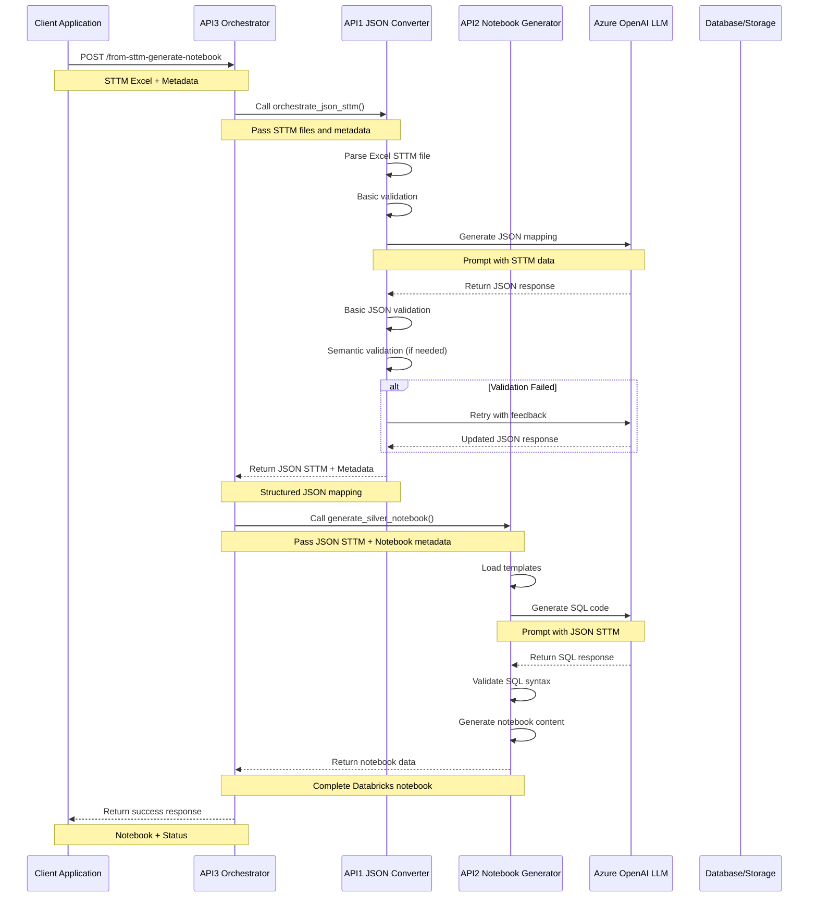
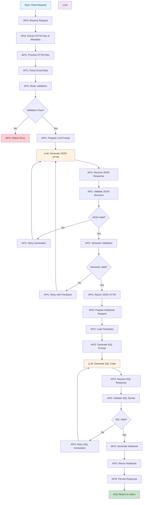
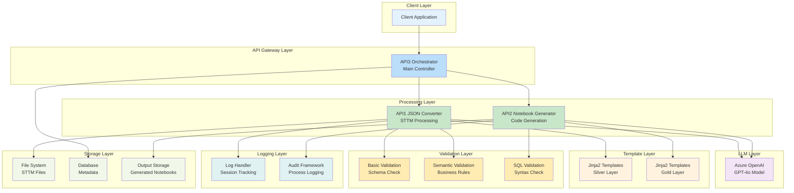

# STTM-to-Notebook Generator v1.0.0: Architecture Diagrams

## 1. Sequence Diagram

## 2. Process Flow Diagram

## 3. System Architecture Diagram

## 4. Component Interaction Details

### API3 Orchestrator (Main Controller)
- **Role**: Central coordinator for the entire process
- **Responsibilities**: 
  - Request validation and routing
  - Error handling and response formatting
  - Session management and logging
  - Integration between API1 and API2

### API1 JSON Converter (STTM Processing)
- **Role**: Converts Excel STTM files to structured JSON
- **Responsibilities**:
  - Excel file parsing and validation
  - LLM prompt generation for JSON creation
  - JSON structure validation
  - Semantic validation with business rules
  - Error recovery and retry logic

### API2 Notebook Generator (Code Generation)
- **Role**: Generates Databricks ETL notebooks
- **Responsibilities**:
  - Template loading and customization
  - SQL code generation via LLM
  - Notebook assembly and formatting
  - SQL syntax validation
  - Output file generation

### Azure OpenAI LLM Layer
- **Model**: GPT-4o
- **Primary Functions**:
  - JSON STTM generation from Excel data
  - SQL code generation from JSON mapping
  - Semantic understanding and validation
  - Error correction and improvement

### Validation Framework
- **Multi-layer validation**:
  - Schema validation (JSON structure)
  - Semantic validation (business logic)
  - SQL validation (syntax and logic)
  - Data quality validation

### Template System
- **Jinja2-based templates**:
  - Silver layer transformation templates
  - Gold layer transformation templates
  - Project-specific customizations
  - Standardized output formatting

---

*Architecture diagrams for STTM-to-Notebook Generator v1.0.0*
*Generated on July 29, 2025* 