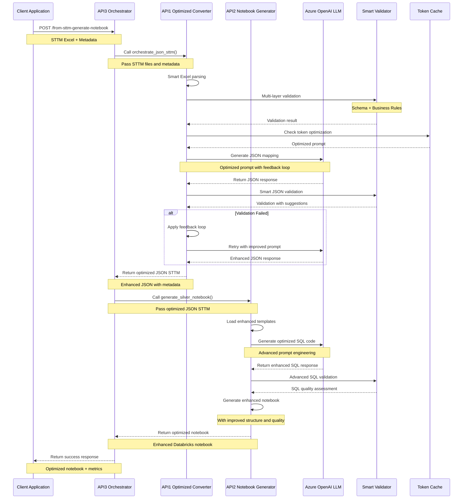
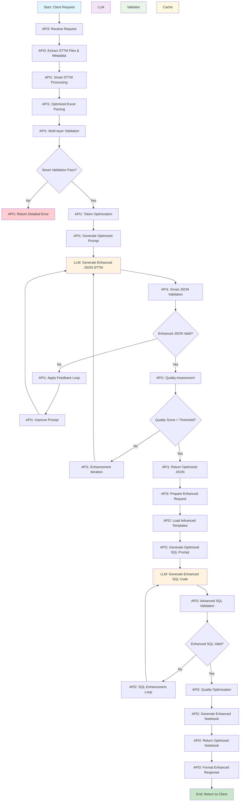

# STTM-to-Notebook Generator v1.1.0: Architecture Diagrams

## 1. Sequence Diagram

## 2. Process Flow Diagram

## 3. System Architecture Diagram

```mermaid
graph TB
    subgraph "Client Layer"
        A[Client Application]
    end
    
    subgraph "API Gateway Layer"
        B[API3 Orchestrator<br/>Enhanced Controller]
    end
    
    subgraph "Optimized Processing Layer"
        C[API1 Optimized Converter<br/>Smart STTM Processing]
        D[API2 Enhanced Generator<br/>Advanced Code Generation]
    end
    
    subgraph "Enhanced LLM Layer"
        E[Azure OpenAI<br/>GPT-4o Model]
        F[Token Optimization<br/>Cache Management]
    end
    
    subgraph "Advanced Template Layer"
        G[Enhanced Jinja2 Templates<br/>Silver Layer]
        H[Enhanced Jinja2 Templates<br/>Gold Layer]
        I[Project-Specific Templates<br/>Custom Domains]
    end
    
    subgraph "Smart Validation Layer"
        J[Multi-layer Validation<br/>Schema + Business Rules]
        K[Semantic Validation<br/>Enhanced Business Logic]
        L[Advanced SQL Validation<br/>Quality Assessment]
        M[Feedback Loop Engine<br/>Continuous Improvement]
    end
    
    subgraph "Performance Layer"
        N[Token Cache<br/>Optimization Engine]
        O[Smart Parsing<br/>Excel Optimization]
        P[Quality Metrics<br/>Performance Tracking]
    end
    
    subgraph "Enhanced Storage Layer"
        Q[Optimized File System<br/>STTM Files]
        R[Enhanced Database<br/>Metadata + Metrics]
        S[Advanced Output Storage<br/>Generated Notebooks]
    end
    
    subgraph "Advanced Logging Layer"
        T[Enhanced Log Handler<br/>Session + Performance]
        U[Advanced Audit Framework<br/>Quality Metrics]
        V[Performance Monitor<br/>Real-time Analytics]
    end
    
    %% Connections
    A --> B
    B --> C
    B --> D
    C --> E
    D --> E
    C --> F
    D --> F
    C --> G
    D --> H
    D --> I
    C --> J
    C --> K
    D --> L
    C --> M
    D --> M
    C --> N
    C --> O
    C --> P
    D --> P
    C --> Q
    B --> R
    D --> S
    C --> T
    D --> U
    B --> V
    
    %% Styling
    style A fill:#e3f2fd
    style B fill:#bbdefb
    style C fill:#c8e6c9
    style D fill:#c8e6c9
    style E fill:#f3e5f5
    style F fill:#f3e5f5
    style G fill:#fff3e0
    style H fill:#fff3e0
    style I fill:#fff3e0
    style J fill:#ffecb3
    style K fill:#ffecb3
    style L fill:#ffecb3
    style M fill:#e8f5e8
    style N fill:#fff8e1
    style O fill:#fff8e1
    style P fill:#fff8e1
    style Q fill:#f1f8e9
    style R fill:#f1f8e9
    style S fill:#f1f8e9
    style T fill:#e0f2f1
    style U fill:#e0f2f1
    style V fill:#e0f2f1
```

## 4. Enhanced Component Interaction Details

### API3 Orchestrator (Enhanced Controller)
- **Role**: Advanced coordinator with performance optimization
- **Responsibilities**: 
  - Smart request validation and routing
  - Advanced error handling and recovery
  - Performance monitoring and metrics
  - Enhanced session management
  - Quality assessment and feedback

### API1 Optimized Converter (Smart STTM Processing)
- **Role**: Advanced Excel STTM processing with optimization
- **Responsibilities**:
  - Smart Excel parsing with optimization
  - Multi-layer validation with feedback
  - Token optimization and caching
  - Enhanced LLM prompt engineering
  - Advanced JSON structure validation
  - Quality scoring and improvement loops
  - Performance metrics tracking

### API2 Enhanced Generator (Advanced Code Generation)
- **Role**: Advanced notebook generation with quality optimization
- **Responsibilities**:
  - Enhanced template loading and customization
  - Advanced SQL code generation via LLM
  - Quality-optimized notebook assembly
  - Advanced SQL validation and assessment
  - Performance-optimized output generation
  - Quality metrics and improvement tracking

### Enhanced Azure OpenAI LLM Layer
- **Model**: GPT-4o with optimization
- **Primary Functions**:
  - Optimized JSON STTM generation
  - Enhanced SQL code generation
  - Advanced semantic understanding
  - Quality-driven error correction
  - Performance-optimized responses

### Smart Validation Framework
- **Multi-layer intelligent validation**:
  - Advanced schema validation with suggestions
  - Enhanced semantic validation with business logic
  - Quality-driven SQL validation
  - Performance-based data quality assessment
  - Continuous improvement feedback loops

### Enhanced Template System
- **Advanced Jinja2-based templates**:
  - Performance-optimized Silver layer templates
  - Quality-enhanced Gold layer templates
  - Domain-specific customizations
  - Advanced output formatting with quality metrics

### Performance Optimization Layer
- **Token optimization and caching**:
  - Smart token usage optimization
  - Response caching for efficiency
  - Performance metrics tracking
  - Quality-driven improvements

### Advanced Monitoring and Analytics
- **Real-time performance tracking**:
  - Token usage analytics
  - Processing time optimization
  - Quality metrics assessment
  - Performance trend analysis

---

*Enhanced architecture diagrams for STTM-to-Notebook Generator v1.1.0*
*Generated on July 29, 2025* 